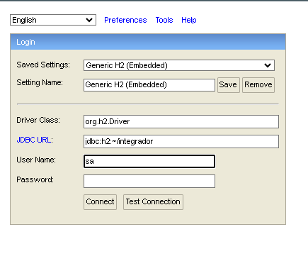

# Proyecto Integrador Final 🚀


Desarrollo de un *Sistema de Gestión de Inventario* para manejar información de Proveedores, Productos y Órdenes de compra simplificando la administración de los inventarios. Posee una capa de seguridad para prevenir errores y notificaciones via Email al usuario.

## Tecnologías y herramientas empleadas 🛠
- **Dependencias**:
	- Spring Web
	- H2 SQL Driver
	- Spring Boot Starter Data JPA
	- Spring Security/JWT
	- Spring Boot Starter Mail
	- Validation

- **Frontend**    
    - Angular con TypeScript
    
- **Backend**   
    - Java 21
    - Spring Boot
      
- **Base de datos**   
    - H2 SQL

## Ejecución local 💻

Pasos necesarios para ejecutar el proyecto localmente

- Ejecutar el proyecto SpringBoot para generar las tablas como Categorias, Rubros, Roles, Tipos de iva, Países, Provincias. 

- Ingresar a la consola H2 de la siguiente manera y con las siguientes credenciales



- Luego ejecutar en la consola de H2 los siguientes inserts
  
[INSERTS SQL](inserts.sql)

- Ingresar a VSC y ejecutar el servidor de Angular (*puerto 4200*)

```bash
  ng serve -o
```
## Documentación 📃
[SWAGGER UI](https://www.localhost:8080/swagger-ui/index.html)

[SWAGGER](integrador.json)

## Aclaraciones sobre Login ❗

La primer pantalla es el **Login**, debe crearse un usuario y se recibirá un mail de bienvenida a la dirección de correo registrada. Para acceder al panel de administrador, luego deben loguearse con el usuario admin que se crea por defecto al levantar la aplicación, con las siguientes credenciales:

```
Username: admin
Password: Admin123
```


## Desarrollador 🧠
Este proyecto fue desarrollado por [Sueldo, Simón](https://www.linkedin.com/in/simonsueldo/) para el BootCamp de ASJ

